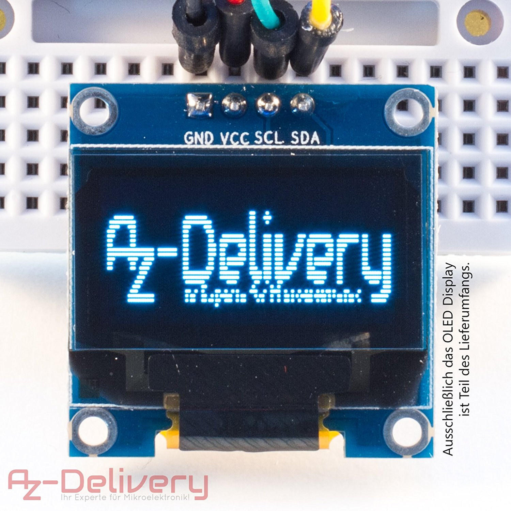
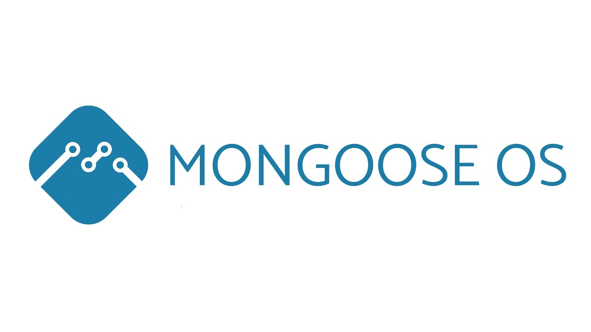

# A Mongoose OS app to test SSD1306 128*64 OLED Display 

## Overview

This is a Mongoose OS app, used to test a SSD1306 128*64 OLED Display using I2C (without RESET PIN).

### Device Tested:
 
- **Marca**:	AZDelivery
- **Modelo**:	AZOLED12864-3

[Device tested](https://www.amazon.es/gp/product/B074N9VLZX/ref=oh_aui_detailpage_o02_s00?ie=UTF8&psc=1)
 

## How to install this app

- Install and start [mos tool](https://mongoose-os.com/software.html)
- Clone this repository locally and enter it. We assume here you are working on a ESP8266 Platform, do the following to build and flash to device.

	1. **Clone** repository & enter it:
		'''
		$ git clone git@github.com:Kike-Ramirez/nodes_Mongoose.git
		$ cd nodes_Mongoose/
		'''

	2. **Build** for platform esp8266 (Change it if you are using another device):
		'''
		$ mos build --arch esp8266
		'''

	3. **Flash** the device:
		'''
		$ mos flash
		'''

	4. Open MOS console to **check logs**:
		'''
		$ mos console
		'''

## Author

Kike Ramírez
https://www.kikeramirez.net
23/4/2018

## License

MIT License

  

